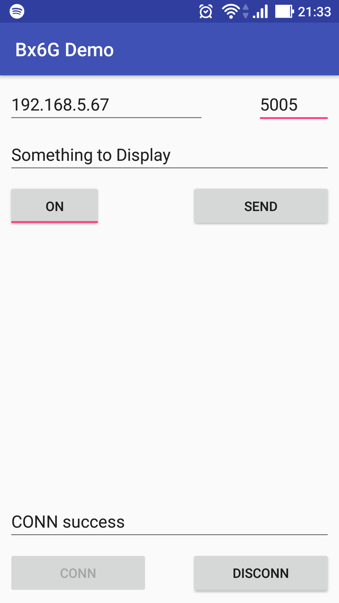

onbon bx06 api for Android
=====================

本文件說明如何在 [Android Studio](https://developer.android.com/studio/index.html) 開發環境下，建立 [onbon.bx06 api](https://github.com/api2doc/onbon.bx06.api) 的開發項目。

github source 提供的項目樣板，測試對象為 BX-6Q2 全彩控制器，資料顯示位置固定為 (96, 0, 32, 32)。



## 相依檔案

#### JAR - onbon bx06 api 核心
* bx06.message-0.5.0-SNAPSHOT.jar

* bx06-0.5.0-SNAPSHOT.jar

* log4j-1.2.14.jar

* simple-xml-2.7.1.jar

* uia.comm-0.2.1.jar

* uia.message-0.5.1.jar

* uia.utils-0.1.2.jar

#### AAR - java.awt for android 核心
* java.awt4a-0.1-release.aar


## project 相關設定

#### build.gradle

* flatDir - 設定相依 libs 的儲存位置。

```
allprojects {
    repositories {
        jcenter()
        flatDir {
            dirs 'libs'
        }
    }
}
```

## app 相關設定

#### build.gradle

* project.ext.set - 設定輸出檔案名稱。

* dexOptions - 允許掛載 Java AWT 4 android。

* dependencies - 加入 API 相關的 jar & aar 共八個檔案。檔案儲存在 libs 資料夾下。


```
android {
    ...
    defaultConfig {
        ...
        project.ext.set("archivesBaseName", "bx6g.mobiledemo-" + defaultConfig.versionName);
    }
    dexOptions {
        preDexLibraries = false
        additionalParameters =["--core-library"]
    }

}

dependencies {
    ...
    compile files('libs/bx06.message-0.5.0-SNAPSHOT.jar')
    compile files('libs/bx06-0.5.0-SNAPSHOT.jar')
    compile files('libs/log4j-1.2.14.jar')
    compile files('libs/simple-xml-2.7.1.jar')
    compile files('libs/uia.comm-0.2.1.jar')
    compile files('libs/uia.message-0.5.1.jar')
    compile files('libs/uia.utils-0.1.2.jar')
    compile(name:'java.awt4a-0.1-release', ext:'aar')
    ...
}

```

#### AndroidManifest.xml

* android:name - 設定啟動應用程式類別，用來建立 BX6G API 運行環境。

* android.permission.INTERNET - 設定允許 Socket 操作。

```
<application
    android:name="onbon.bx06.mobiledemo.MainApplication"
    ...>
</application>
<uses-permission android:name="android.permission.INTERNET" />
```


#### MainApplication.java

* 對應於 AndroidManifest.xml 中 android:name 的設定。

```
package onbon.bx06.mobiledemo;

import android.app.Application;
import onbon.bx06.Bx6GEnv;

public class MainApplication extends Application {

    private boolean initial;

    @Override
    public void onCreate() {
        super.onCreate();

        try {
            // java.awt for android 初始化
            AwtEnv.link(this);                          // 將 Application 與 AWT 連結
            AwtEnv.configPaintAntiAliasFlag(true);      // 設定圖案是要抗鋸齒。

            // 建立 BX6G API 運行環境。
            Bx6GEnv.initial();

            this.initial = true;
        }
        catch (Exception ex) {
            this.initial = false;
        }
    }
}
```
